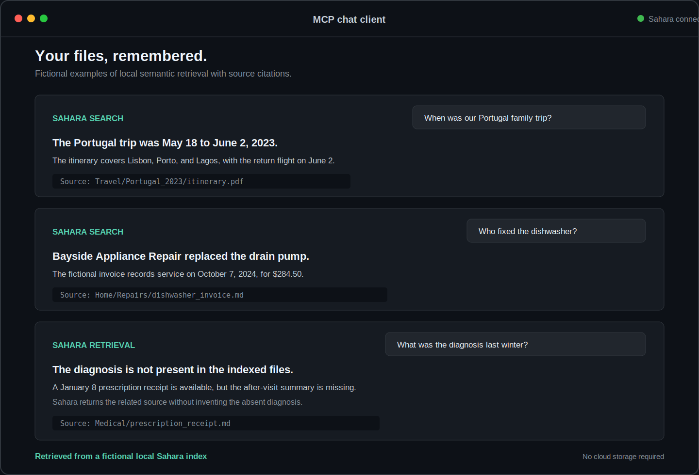

# Sahara

[](https://github.com/nidheesh-p/sahara/actions/workflows/ci.yml)
[](https://github.com/nidheesh-p/sahara/releases/latest)
[](https://www.python.org/)
[](LICENSE)

> Extended storage, searchable memory and instant retrieval.

Sahara turns folders on your computer into searchable memory. Find files by meaning,
ask questions with cited sources, and expose the same local index to MCP clients.
External drives, MinIO, and AWS storage are optional extensions, not prerequisites.

**Local-first:** indexing and semantic search run on your computer. No account, API
key, storage bucket, or additional drive is required for the core search experience.

**Latest release:** [v0.2.1](https://github.com/nidheesh-p/sahara/releases/tag/v0.2.1)
(June 7, 2026) adds index-only setup, multiple content roots, verified offload/fetch,
one-command Claude Desktop setup, and trusted `sahara-memory` packaging. See the
[changelog](CHANGELOG.md).



<sub>Fictional documents shown in a generic MCP client. Sahara retrieves from the
configured local index, cites its sources, and reports when a requested detail is
absent.</sub>

## What Sahara Does

- Searches PDFs, DOCX files, notes, code, and other text documents by meaning
- Answers questions over indexed files with source paths and supporting snippets
- Indexes multiple folders without copying them to a storage backend
- Exposes read-only search and Q&A tools through MCP
- Optionally syncs selected folders to a drive, NAS, MinIO, or AWS S3
- Can offload verified stored files while keeping their indexed content searchable

Sahara is a single-user CLI and local retrieval service. It is not a hosted cloud
service, autonomous agent, or general filesystem access layer.

## Quick Start

Sahara requires Python 3.11 or newer.

The Python distribution is named **`sahara-memory`**, but it installs the `sahara`
command. Do not run `pip install sahara`; that name belongs to the unrelated OpenStack
project.

Install Sahara from PyPI with
[pipx](https://pipx.pypa.io/stable/installation/), which keeps CLI applications
isolated from the system Python:

```bash
pipx install "sahara-memory[search,mcp]"

sahara init --mode basic --folder ~/Documents
sahara index
sahara search "my tax return from 2024" --snippet
```

See [Installation](docs/INSTALLATION.md) for macOS and Windows `pipx` setup, a virtual
environment alternative, and the `externally-managed-environment` fix. Do not use
`--break-system-packages`.

The first `sahara index` downloads a local embedding model of roughly 70 MB.
Hugging Face may show an unauthenticated-download warning; no account or token is
required.

Add more folders whenever you need them:

```bash
sahara folder add ~/Projects
sahara index
```

Every folder added this way remains index-only unless you explicitly enable storage
sync for it.

## Ask Questions

`sahara ask` is retrieval-only by default. It returns ranked source snippets without
contacting Ollama, OpenAI, or another standalone answer model:

```bash
sahara ask --snippet "what does the lease say about pets?"
```

An MCP client can reason over the same retrieved evidence with its own model. Enable a
separate answer provider only when you want the Sahara CLI or MCP tool to generate the
answer itself.

### Optional local answers with Ollama

Install [Ollama](https://ollama.com/download), then download Sahara's default model:

```bash
ollama pull mistral
sahara config set answer_provider ollama
sahara ask --snippet "what does the lease say about pets?"
```

The current Mistral download is approximately 4.4 GB. If Ollama is not already running,
launch the application or run `ollama serve` in another terminal.

### OpenAI without Ollama

Ollama is not required when you prefer OpenAI:

```bash
export OPENAI_API_KEY="your-api-key"
sahara config set answer_provider openai
sahara ask --snippet "what does the lease say about pets?"
```

Windows PowerShell:

```powershell
$env:OPENAI_API_KEY = "your-api-key"
sahara config set answer_provider openai
sahara ask --snippet "what does the lease say about pets?"
```

Sahara stores the provider preference, not the API key. When OpenAI is selected, the
question and retrieved snippets needed to answer it are sent to OpenAI. OpenAI API
billing is separate from a ChatGPT subscription.

See [Answer Provider Setup](docs/ANSWER_PROVIDERS.md) for installation, model selection,
privacy details, and troubleshooting.

## Connect an MCP Client

Sahara exposes five read-only MCP tools for search, cited Q&A, chunk reads, folder
listing, and index status. These tools operate only on Sahara's indexed corpus; they
cannot browse arbitrary files or modify your data.

No standalone Sahara answer provider is required; the MCP client can use Sahara's
retrieved snippets directly. Claude Desktop is the first tested client:

```bash
sahara mcp install-claude
```

Fully quit and reopen Claude Desktop, then confirm **sahara** appears under
**Connectors**. The installer preserves existing settings and MCP servers, uses Sahara's
absolute executable path, and creates a backup before changing an existing config.

See [Claude Desktop Setup](docs/CLAUDE_DESKTOP.md) for verification and troubleshooting,
or [MCP Integrations](docs/integrations/chat-agents.md) for the tool surface and
authenticated remote transport.

## Optional Storage

Start with local indexing. Add storage later without rebuilding the semantic index.

| Setup | What it provides | Status |
|---|---|---|
| Basic | Local indexing across one or more folders | Core mode |
| Local drive | Copies selected folders to an external drive, NAS, or network share | Optional |
| AWS | Copies selected folders to S3, with optional Glacier features | Optional |

Attach a local drive:

```bash
sahara storage configure local --drive /Volumes/Archive/Sahara
sahara folder sync ~/Documents --enable
sahara sync
```

Attach AWS:

```bash
sahara storage configure aws \
  --bucket my-sahara-bucket \
  --region us-east-1
sahara folder sync ~/Documents --enable
sahara sync
```

MinIO and local-plus-Glacier modes are available through the interactive
`sahara init` wizard. See [Getting Started](docs/GETTING_STARTED.md) for storage
credentials, content-root behavior, deletion semantics, and migration paths.

After a file has been synced and indexed, Sahara can free its source disk space while
retaining search metadata:

```bash
sahara offload Documents/archive/report.pdf
sahara fetch Documents/archive/report.pdf
```

Offload verifies the stored copy before removing the local source. Ordinary filesystem
deletion is not treated as offload.

## Privacy and Security

- The semantic index is stored locally in `~/.sahara/state.db`.
- Indexing, embeddings, and `sahara search` stay local.
- Ollama answer generation stays local when explicitly enabled.
- OpenAI receives the question and retrieved snippets when explicitly selected.
- MCP is read-only and scoped to indexed content.
- Remote MCP requires authentication by default and supports tool, folder, and snippet
  limits.
- Optional storage encryption uses client-side AES-256-GCM.

Review [SECURITY.md](SECURITY.md) before exposing MCP remotely or relying on encrypted
storage.

## Supported Content

Sahara extracts text from:

- PDF and DOCX documents
- Markdown, reStructuredText, and plain text
- Python, JavaScript, TypeScript, JSON, YAML, TOML, CSV, HTML, and XML
- Other files that can be safely detected as UTF-8 text

Current limitations:

- Scanned PDFs and images are not searchable because OCR is not implemented yet.
- Audio and video transcription are not supported.
- Sahara is designed for one user and one local index.
- The project is beta; keep independent backups of important files.

Use `sahara index-report` to inspect indexed files, unsupported content, and failures.

Create a `.saharaignore` file in any indexed folder to exclude content using
gitignore-style patterns:

```gitignore
.env*
secrets/
node_modules/
*.tmp
```

Start from the [example ignore file](.saharaignore.template) for common operating-system,
editor, build, and credential exclusions.

## Core Commands

| Command | Purpose |
|---|---|
| `sahara init --mode basic --folder PATH` | Create an index-only local library |
| `sahara folder add/list/remove` | Manage indexed folders |
| `sahara index [--force]` | Build or refresh the semantic index |
| `sahara index-report` | Inspect indexing coverage and failures |
| `sahara search QUERY` | Find files and passages by meaning |
| `sahara ask --snippet QUESTION` | Retrieve cited sources and optionally generate an answer |
| `sahara mcp install-claude` | Connect Sahara to Claude Desktop |
| `sahara mcp serve` | Run the read-only MCP server |

<details>
<summary><strong>Storage and operational command groups</strong></summary>

| Command group | Purpose |
|---|---|
| `sahara storage ...` | Configure, inspect, or disable optional storage |
| `sahara folder sync ...` | Choose which indexed folders also sync |
| `sahara sync/push/pull/status` | Inspect and execute storage synchronization |
| `sahara offload/fetch` | Free and restore local space with verification |
| `sahara encryption ...` | Configure or rotate storage encryption |
| `sahara doctor` | Diagnose configuration and connectivity |
| `sahara daemon ...` | Manage background watching and synchronization |
| `sahara config ...` | Inspect or change configuration |

See the [complete command reference](docs/COMMAND_REFERENCE.md), or run
`sahara --help` and `sahara COMMAND --help` for live CLI help.

</details>

## Documentation

- [Getting Started](docs/GETTING_STARTED.md): index-only, local-drive, and AWS paths
- [Installation](docs/INSTALLATION.md): pipx, virtual environments, and PEP 668
- [Command Reference](docs/COMMAND_REFERENCE.md): every CLI command grouped by purpose
- [Answer Providers](docs/ANSWER_PROVIDERS.md): Ollama and OpenAI setup
- [Claude Desktop](docs/CLAUDE_DESKTOP.md): installation, MCP contract, and troubleshooting
- [Security](SECURITY.md): threat model, encryption, and vulnerability reporting
- [Roadmap](ROADMAP.md): current scope, planned work, and non-goals
- [Architecture](ARCHITECTURE.md): system design and extension points
- [Contributing](CONTRIBUTING.md): development setup, tests, and pull requests
- [Changelog](CHANGELOG.md): release history

## License

Sahara is available under the [MIT License](LICENSE).
